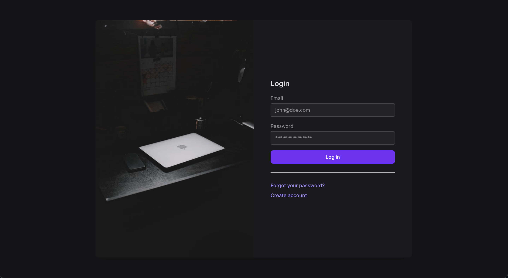
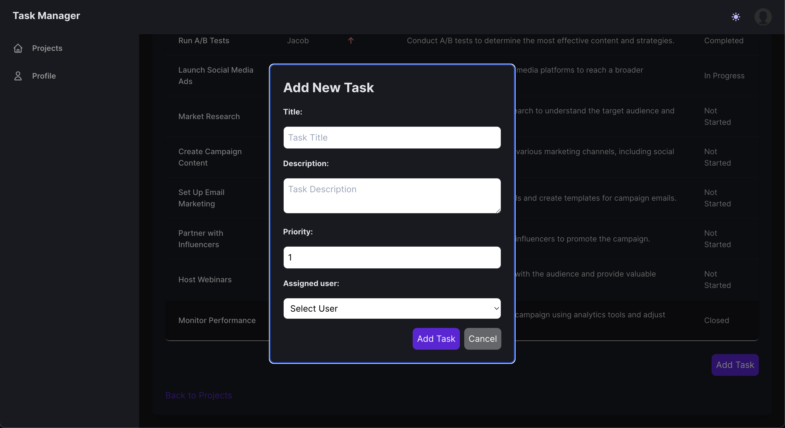
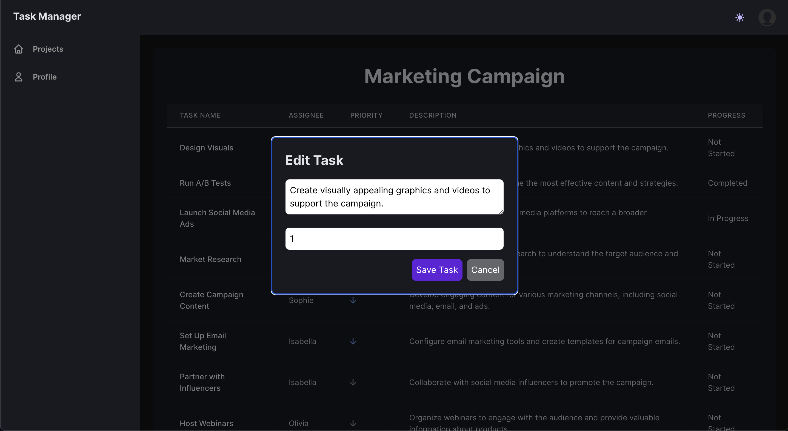
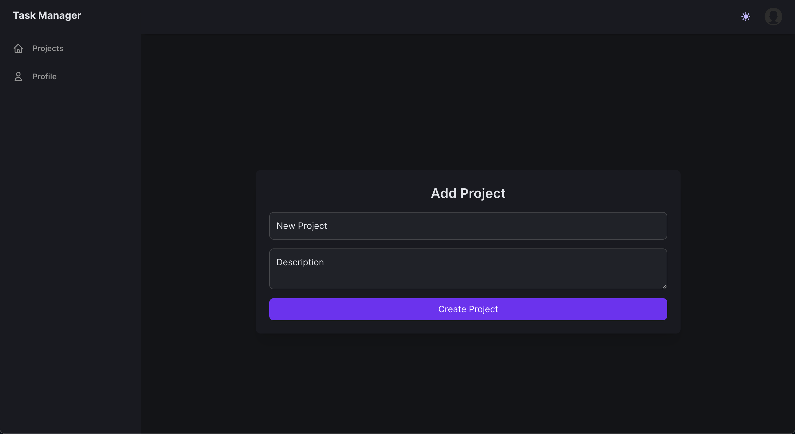
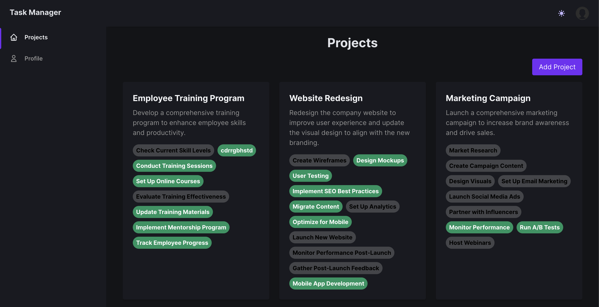
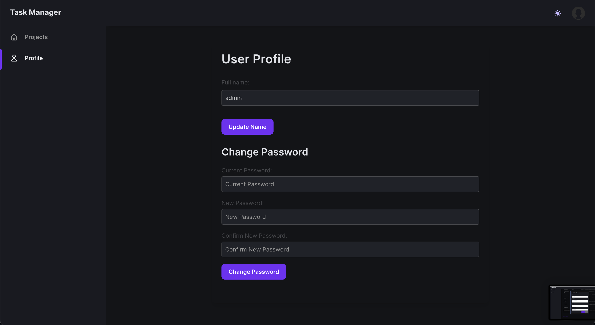
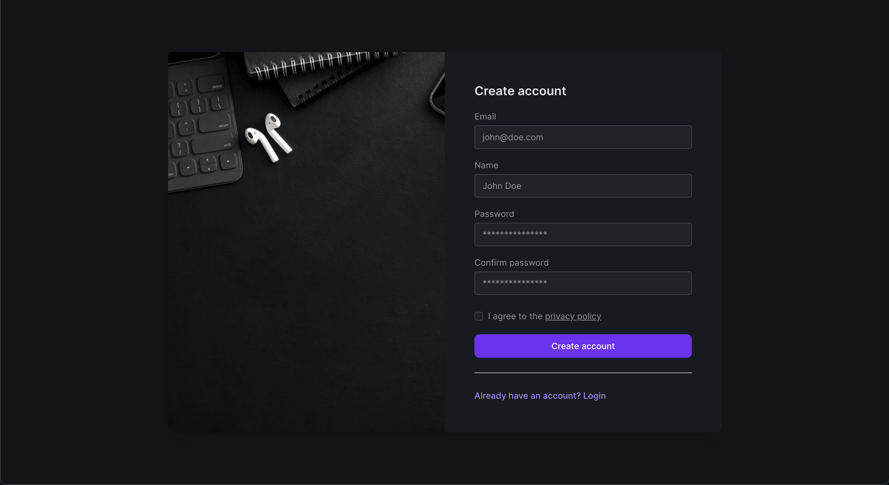
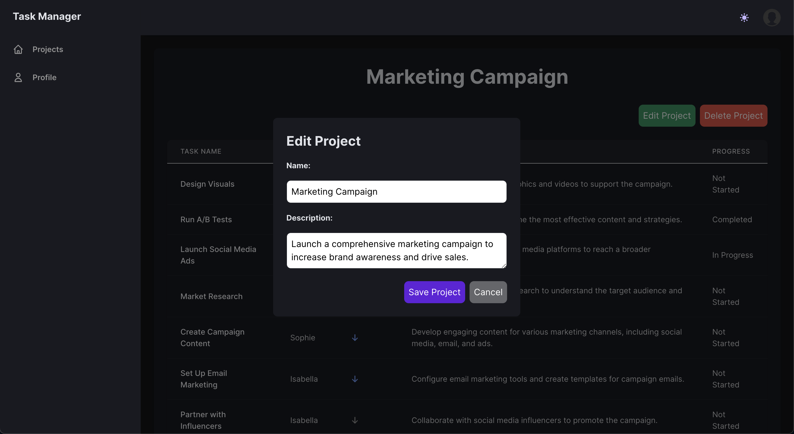
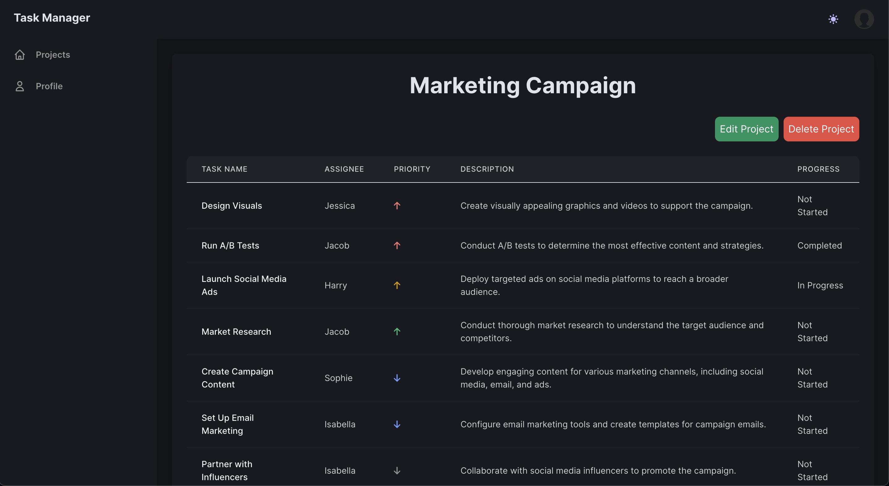
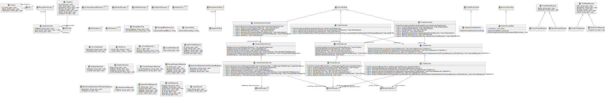

# Taskmanager

## Opis

Taskmanager to zaawansowany system do zarządzania zadaniami, który umożliwia użytkownikom efektywną organizację pracy i śledzenie postępów. Dzięki bezpiecznemu dostępowi poprzez autoryzację loginem i hasłem, zapewnia ochronę wszystkich informacji i zadań dodanych do systemu.

## Funkcje

### Bezpieczny dostęp

- **Autoryzacja**: Taskmanager zapewnia bezpieczny dostęp poprzez mechanizm logowania, co gwarantuje ochronę prywatności i bezpieczeństwo danych.



### Zadania i zlecenia

- **Tworzenie zadań**: Użytkownicy mogą łatwo tworzyć nowe zadania i zlecenia, co umożliwia efektywne zarządzanie workflow i monitorowanie postępów prac.



- **Przypisywanie zadań**: Zadania mogą być przypisane do konkretnych użytkowników, co pozwala na klarowne określenie odpowiedzialności.
- **Dodawanie pasków postępu**: Użytkownicy mogą dodawać paski postępu do zadań, co umożliwia wizualne śledzenie stopnia realizacji zadań.
- **Edytowanie zadań**: Zadania mogą być edytowane w celu aktualizacji szczegółów takich jak opis, termin, priorytet i przypisani użytkownicy.



- **Usuwanie zadań**: Użytkownicy mogą usuwać zadania, które są już nieaktualne lub zakończone, co pomaga w utrzymaniu porządku w projektach.

### Zarządzanie projektami

- **Tworzenie projektów**: Admini mogą tworzyć nowe projekty i przypisywać do nich zadania.



- **Aktualizacja i usuwanie projektów**: Projekty mogą być aktualizowane i usuwane przez uprawnionych użytkowników.
- **Śledzenie postępów projektów**: Umożliwia monitorowanie postępów prac w projektach i analizowanie efektywności zespołów.



### Zarządzanie użytkownikami

- **Rejestracja i logowanie**: Nowi użytkownicy mogą się rejestrować, a istniejący logować do systemu.
- **Profil użytkownika**: Użytkownicy mogą przeglądać i aktualizować swoje profile oraz zmieniać hasła.



- **Role i uprawnienia**: System zarządza rolami użytkowników (admin, user) i przydziela odpowiednie uprawnienia, co zapewnia kontrolę dostępu do zasobów.



### Widok Administratora

- **Dodawanie projektów**: Administratorzy mają możliwość dodawania nowych projektów.


- **Edytowanie projektów**: Administratorzy mogą edytować szczegóły projektów.



- **Przypisywanie zadań do projektów**: Administratorzy mogą przypisywać zadania do projektów.



### Widok Użytkownika

- **Edytowanie zadań**: Użytkownicy mogą edytować opis i postęp zadań, które zostały im przypisane.


- **Podgląd projektów**: Użytkownicy mogą przeglądać projekty i zadania, które zostały im przypisane.


### Diagram Aplikacji Taskmanager

Poniżej znajduje się diagram przedstawiający strukturę i interfejs aplikacji Taskmanager. Diagram ten ilustruje główne komponenty systemu oraz interakcje między nimi, co pomaga w zrozumieniu przepływu pracy i funkcjonalności aplikacji.




## Instalacja

```bash
# Sklonuj repozytorium
git clone https://github.com/Lefjuu/studia-management

# Przejdź do katalogu projektu
cd taskmanager

# Uruchom aplikację
dotnet build


## Instalacja

```bash
# Sklonuj repozytorium
git clone https://github.com/Lefjuu/studia-management

# Przejdź do katalogu projektu
cd taskmanager

# Uruchom aplikację
dotnet build
```

## Technologie

Projekt Taskmanager wykorzystuje nowoczesne technologie zarówno w części serwerowej, jak i klienckiej, co zapewnia wysoką wydajność i skalowalność systemu.

### Backend

- **ASP.NET Core**: Serwerowa część aplikacji została napisana w ASP.NET Core, co gwarantuje stabilność, bezpieczeństwo oraz efektywne zarządzanie zasobami.
- **JWT**: Używamy JSON Web Tokens do autoryzacji i zabezpieczenia API.
- **MongoDB**: Nierelacyjna baza danych, która oferuje wysoką wydajność, automatyczną skalowalność i łatwość w zarządzaniu dużymi ilościami danych.

### Frontend

- **React**: Interfejs użytkownika został zbudowany przy użyciu biblioteki React, która umożliwia tworzenie dynamicznych i responsywnych aplikacji webowych.

## Użytkowanie

### Logowanie

- Zaloguj się, używając swojego loginu i hasła.

### Zarządzanie zadaniami

- Dodawaj nowe zadania i zlecenia, przypisując im odpowiednie terminy i priorytety.
- Przypisuj zadania konkretnym użytkownikom, aby określić odpowiedzialność za ich realizację.
- Dodawaj paski postępu do zadań, aby wizualnie śledzić postępy.
- Edytuj zadania, aby aktualizować szczegóły takie jak opis, termin, priorytet i przypisani użytkownicy.
- Usuwaj zadania, które są już nieaktualne lub zakończone, aby utrzymać porządek w projektach.

### Śledzenie postępów

- Monitoruj postępy w realizacji zadań i dziel się pomysłami oraz postępami z innymi użytkownikami.

## Backend - Szczegóły implementacji

### Usługi (Services)

#### AuthenticationService

Odpowiada za logikę biznesową związaną z uwierzytelnianiem użytkowników i zarządzaniem ich profilami. Obsługuje rejestrację, logowanie, aktualizację profili oraz zmianę haseł.

#### ProjectService

Odpowiada za zarządzanie projektami. Umożliwia tworzenie, aktualizowanie, usuwanie projektów oraz przypisywanie zadań do projektów. Dzięki tej usłudze możliwe jest także śledzenie postępów w realizacji projektów.

#### TaskService

Odpowiada za zarządzanie zadaniami w projektach. Umożliwia tworzenie, aktualizowanie, usuwanie zadań oraz śledzenie ich postępów. Obsługuje także przypisywanie zadań do konkretnych użytkowników.


## Analiza kodu pod względem zasad programowania obiektowego

W poniższej analizie przedstawiono przykłady zastosowania generyczności, hermetyzacji, polimorfizmu oraz obiektowości w aplikacji.

### Generyczność
Generyczność w C# jest reprezentowana głównie poprzez użycie generyków. W naszym kodzie możemy zobaczyć przykłady generyczności w następujących fragmentach:

1. **Konfiguracja MongoDbIdentity**:
   ```csharp
   builder.Services.ConfigureMongoDbIdentity<ApplicationUser, ApplicationRole, Guid>(mongoDbIdentityConfig);
   ```

2. **UserManager i RoleManager**:
   ```csharp
   .AddUserManager<UserManager<ApplicationUser>>()
   .AddRoleManager<RoleManager<ApplicationRole>>()
   ```

### Hermetyzacja
Hermetyzacja polega na ukrywaniu stanu wewnętrznego obiektu i wymaganiu, aby wszystkie interakcje odbywały się za pośrednictwem metod obiektu. Kod pokazuje hermetyzację w kilku miejscach:

1. **Pola prywatne i właściwości publiczne**:
   ```csharp
   public class ApplicationUser : MongoIdentityUser<Guid>
   {
       public string FullName { get; set; }
       public bool IsConnected { get; set; } = false;
       public DateTime LastModified { get; set; } = DateTime.Now;
       public DateTime CreatedAt { get; set; } = DateTime.Now;
       public string Role { get; set; } = RoleEnum.User;
   }
   ```

2. **Serwisy**:
   Klasa `AuthenticationService` ukrywa szczegóły implementacji uwierzytelniania i zapewnia metody takie jak `RegisterAsync`, `LoginAsync`, `GetMyProfileAsync` itp.

### Polimorfizm
Polimorfizm w C# jest realizowany poprzez interfejsy i dziedziczenie. Kod pokazuje polimorfizm w następujący sposób:

1. **Implementacja interfejsów**:
   ```csharp
   public class AuthenticationService : IAuthenticationService
   {
       // Implementacja metod zdefiniowanych w interfejsie
   }
   ```

2. **Dziedziczenie**:
   ```csharp
   public class ApplicationUser : MongoIdentityUser<Guid>
   ```

### Zasady Programowania Obiektowego
Aplikacja stosuje zasady programowania obiektowego poprzez użycie klas, interfejsów i struktury metod.

1. **Klasy i obiekty**:
   Istnieje kilka klas, takich jak `ApplicationUser`, `AuthenticationService`, `RegisterRequest`, itp.

2. **Metody i właściwości**:
   Te klasy kapsułkują dane i zapewniają metody do operowania na tych danych.

3. **Wstrzykiwanie zależności (Dependency Injection)**:
   Kod korzysta z wstrzykiwania zależności do zarządzania serwisami i ich cyklami życia, co jest kluczowym elementem tworzenia modularnych i testowalnych aplikacji obiektowych.

### Konkretny kod
1. **Generyczność**:
   - `ConfigureMongoDbIdentity<ApplicationUser, ApplicationRole, Guid>(mongoDbIdentityConfig)`

2. **Hermetyzacja**:
   - Metody w `AuthenticationService`, takie jak `RegisterAsync`, `LoginAsync` itp.
   - Metody w `ProjectService`, takie jak `CreateProjectAsync`, `GetProjectByIdAsync` itp.
   - Metody w `TaskService`, takie jak `AddTaskToProjectAsync`, `UpdateTaskAsync` itp.

3. **Polimorfizm**:
   - `AuthenticationService : IAuthenticationService`
   - `ProjectService : IProjectService`
   - `TaskService : ITaskService`
   - `ApplicationUser : MongoIdentityUser<Guid>`

### Zasady Programowania Obiektowego
- **Dziedziczenie**: `public class ApplicationUser : MongoIdentityUser<Guid>`
- **Abstrakcja**: Użycie interfejsów takich jak `IAuthenticationService`, `IProjectService`, `ITaskService`.
- **Hermetyzacja**: Właściwości w klasach i metody operujące na tych właściwościach.
- **Polimorfizm**: Implementacja interfejsów i nadpisywanie metod.

### Przykłady z dodatkowego kodu

#### ProjectController
- Hermetyzacja poprzez prywatne pola `_projectService` i `_taskService` oraz publiczne metody kontrolera.
- Polimorfizm poprzez korzystanie z interfejsów `IProjectService` i `ITaskService`.

#### TaskController
- Hermetyzacja poprzez prywatne pola `_projectService` i `_taskService` oraz publiczne metody kontrolera.
- Polimorfizm poprzez korzystanie z interfejsów `IProjectService` i `ITaskService`.

#### ProjectService
- Hermetyzacja w metodach serwisu takich jak `CreateProjectAsync`, `GetProjectByIdAsync` itp.
- Polimorfizm poprzez implementację interfejsu `IProjectService`.

#### TaskService
- Hermetyzacja w metodach serwisu takich jak `AddTaskToProjectAsync`, `UpdateTaskAsync` itp.
- Polimorfizm poprzez implementację interfejsu `ITaskService`.


## Contributing

Zapraszamy do współpracy! Jeśli masz pomysły, uwagi lub chciałbyś dodać nowe funkcje, otwórz zgłoszenie lub wyślij pull request.